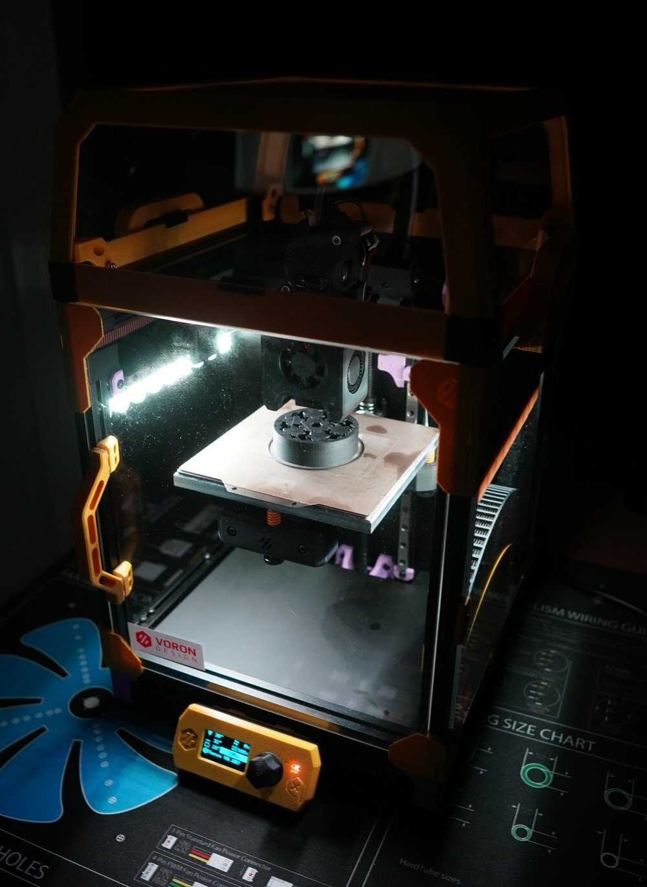

# Voron V0.807 - Spyro #

Config and settings for my [Voron V0.1](https://vorondesign.com/voron0.1) printer.

## Mods ## 

The printer is based on the LDO kit, but have received a few modifications over time:

* [Raspberry pi camera](./stls/camera/).
* [Addressable led strips](./stls/led-strip-mount/).
* [Dragon hotend](https://www.phaetus.com/phaetus-x-voron-hotend-st/).
* [V0 Display](https://github.com/VoronDesign/Voron-Hardware/tree/master/V0_Display).
* [Nevermore Micro V4 filter](https://github.com/nevermore3d/Nevermore_Micro).
* [LGX Lite extruder](https://www.bondtech.se/product/lgx-lite-large-gears-extruder/),
  using a [slightly modified](stls/lgx-lite-mount) [MiniASLGXerpaLiteMount](https://github.com/camerony/VoronCustom/tree/main/MiniASLGXerpaLiteMount) on the [Mini AfterSherpa](https://github.com/KurioHonoo/Mini-AfterSherpa/blob/main/STL/Mini_AfterSherpa/Mini_AfterSherpa_Dragon(fly).stl) toolhead. 
* [Umbilical and Toolhead PCB](https://github.com/VoronDesign/Voron-Hardware/tree/master/V0-Umbilical) - not ideal with the LGX, but works.
* [Tophat Riser](https://thangs.com/crankshaft/Voron-01-Tophat-Riser-31352) - as the LGX requires a bit more space.
* [Kirigami Bed](https://github.com/christophmuellerorg/voron_0_kirigami_bed)
* [MGN9C X rail](https://github.com/VoronDesign/VoronUsers/tree/master/printer_mods/hartk1213/Voron0_MGN9C_X_Axis)
* [SKR Pico controller](https://www.biqu.equipment/products/btt-skr-pico-v1-0) - just because the RP2040 is a cool :)
* [Composite panels](https://fermio.xyz/fermio-labs-gmbh/voron0-v0.1-aluminium-composite-panels-120-spec-voron-hexagon-logo/)

Planned mods:
* LDO-36STH20-1004AHG - as the current "17" gets really hot above 300-400mA.

